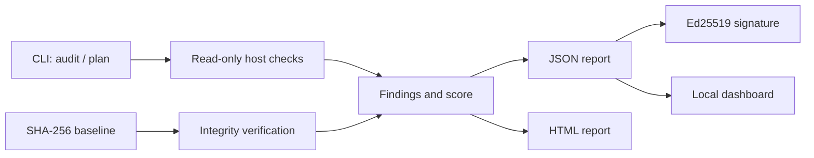
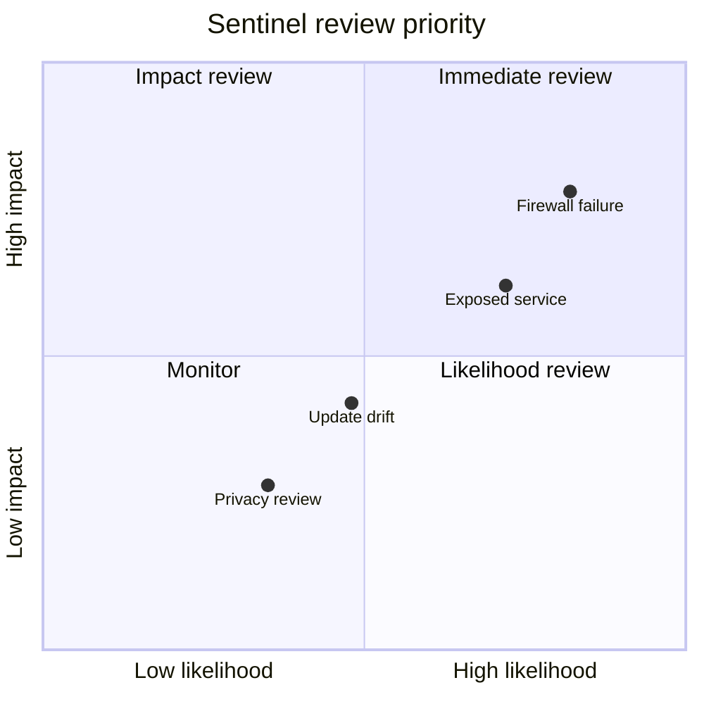

# SafeStack Sentinel

SafeStack Sentinel is a local, read-only security and privacy auditor for
macOS, Kali Linux, Ubuntu, and Raspberry Pi systems. It checks the host,
reports evidence, and produces remediation guidance without changing firewall,
SSH, packages, services, or user files.

## Quick start

```bash
python3 -m venv .venv
source .venv/bin/activate
python -m sentinel audit --json report.json --html report.html
python -m unittest discover -v
```

Create and verify a file-integrity baseline:

```bash
python -m sentinel baseline create baseline.json /etc/ssh/sshd_config
python -m sentinel baseline verify baseline.json
python -m sentinel plan --profile kali-vm --json remediation-plan.json
python -m sentinel keygen sentinel-private.pem sentinel-public.pem
python -m sentinel sign report.json report.sig sentinel-private.pem
python -m sentinel verify-signature report.json report.sig sentinel-public.pem
```

The MVP uses only the Python standard library. See [`docs/USAGE.md`](docs/USAGE.md)
for all commands and [`docs/SECURITY.md`](docs/SECURITY.md) for the trust model.

## What it checks

- host platform and kernel identity;
- firewall state on macOS and Linux/UFW;
- listening network sockets;
- SSH root and password authentication directives;
- pending APT upgrades on Debian-family systems;
- SHA-256 baselines for selected files.
- Ed25519 report signatures and portable host profiles.
- Read-only remediation plans and a localhost report dashboard.

The report includes a score, severity, status, evidence, and a suggested
remediation. A `review` or `unknown` result is deliberately not treated as a
pass.

Run `python -m sentinel dashboard .` to serve local reports at
`http://127.0.0.1:8765/`.

## Architecture



## Risk prioritization

The audit score is supported by a simple X/Y view: likelihood on X and impact
on Y. Findings in the upper-right area deserve the earliest human review.



## Design principles

Sentinel is local-first, read-only by default, explicit about uncertainty, and
free of telemetry. It does not scan third-party targets or make network
changes. Any future remediation command must be separate from the audit path,
show a dry-run plan, and require explicit confirmation.

## Repository layout

```text
sentinel/       auditor, reports, and integrity commands
tests/          unit tests
docs/           operational and security documentation
```

## License

Released under the MIT License. See [`LICENSE`](LICENSE). SafeStack names and
marks remain the property of their respective owners.
